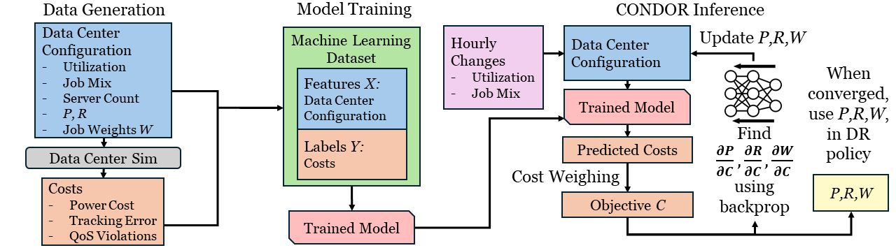

# CONDOR: Learning a Data Center Model for Efficient Demand Response

Repository for paper "Learning a Data Center Model for Efficient Demand Response" (Clark, Acun, Paschyllidis, Coskun 24). HotCarbon’24, July 09, 2024, Santa Cruz, CA.

## Overview 

This is the repository for CONDOR (Cost-Optimization Neural network for Data center Operational demand Response). CONDOR is a machine learning (ML) based method for enabling large data centers to participate in a regulation service reserve based demand response (DR) program. 

The figure above gives a high-level overview of CONDOR. We trained a neural network on data collected from a simulated data center participating in our regulation service DR program, with the network's goal learning how well a given data center configuration participates in the DR program. We then use the final trained model at inference time by iteratively updating the data center configuration paramaters we have control over with the goal of minimizing the DR participation cost. In our case, we update the data center's expected upcoming average power, reserve capacity, and the percent of servers in the data center given to each job type the data center must run. 

## Getting Started

CONDOR was developed and implemented in Python. To install CONDOR, clone our repository and install the appropriate libraries. We reccomend using the Conda package manager. To create an environment with the appropriate libraries, TODO - add installation info for the requirements.txt file.

### Usage

To quickly get started, see the condor_inference_example.ipynb notebook in the model_prediction_experiments folder. More details can be found in seperate README files in the data and model_prediction_experiments folders. 

## Authors

Main Contact - Quentin Clark: q.clark@mail.utoronto.ca
